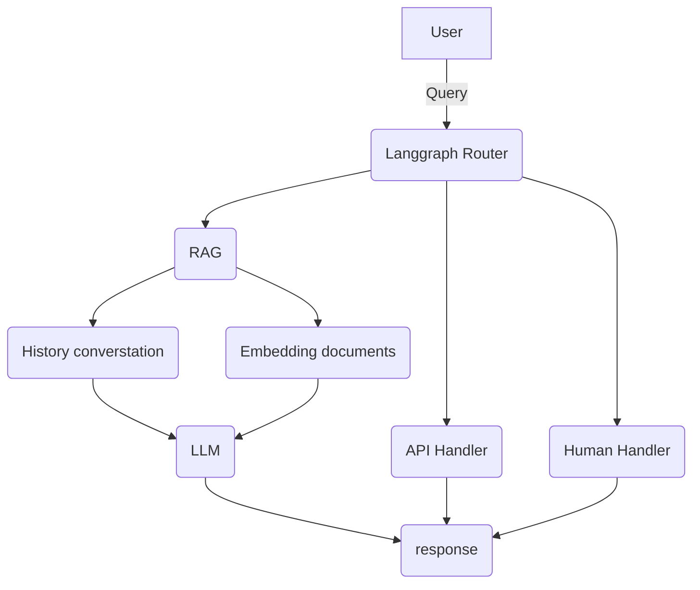

# Ask My Company: Hệ thống hỏi đáp nội bộ doanh nghiệp

## Mục đích
Ask My Company giúp nhân viên truy vấn thông tin nội bộ doanh nghiệp dựa trên tài liệu có sẵn, tăng hiệu quả tra cứu và đảm bảo thông tin nhất quán.

## Kiến trúc tổng quan
Dưới đây là sơ đồ kiến trúc hệ thống:

## Các thành phần chính
- `db/`: Xử lý tài liệu, nhúng, hội thoại, dữ liệu.
- `handlers/`: Xử lý API, hội thoại, truy vấn AI.
- `router/`: Định tuyến luồng xử lý.
- `sample_docs/`: Tài liệu mẫu thử nghiệm.

## Cách hoạt động
1. **Nạp tài liệu**: Tài liệu nội bộ (PDF, TXT, MD) được chuyển đổi và nhúng vào hệ thống.
2. **Truy vấn**: Người dùng gửi câu hỏi qua API/giao diện.
3. **Xử lý hội thoại**: Human Handler tiếp nhận, quản lý luồng hội thoại.
4. **Truy vấn AI**: RAG Handler tìm kiếm, tổng hợp thông tin từ tài liệu đã nhúng.
5. **Trả lời**: Kết quả trả về cho người dùng, lưu lịch sử hội thoại.

## Lợi ích
- Tra cứu thông tin nội bộ nhanh chóng
- Giảm thời gian đào tạo nhân viên mới
- Thông tin nhất quán, dễ cập nhật

---
*Dự án phù hợp cho doanh nghiệp muốn xây dựng hệ thống hỏi đáp nội bộ thông minh, dễ mở rộng và bảo trì.*

---
**Sơ đồ kiến trúc minh họa:**

> *Bạn có thể copy sơ đồ mermaid này vào Substack hoặc các nền tảng hỗ trợ để hiển thị trực quan.*
