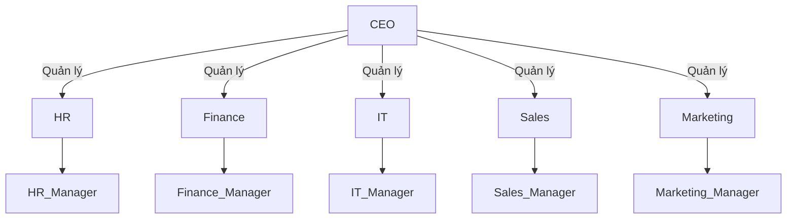

# Giới thiệu sơ đồ công ty

## Sơ đồ tổ chức



## Các phòng ban

| Phòng ban      | Chức năng chính                | Quản lý         |
|---------------|-------------------------------|-----------------|
| Nhân sự (HR)  | Tuyển dụng, đào tạo, phúc lợi  | HR_Manager      |
| Tài chính     | Kế toán, báo cáo, ngân sách   | Finance_Manager |
| CNTT (IT)     | Quản trị hệ thống, bảo mật     | IT_Manager      |
| Kinh doanh    | Bán hàng, chăm sóc khách hàng | Sales_Manager   |
| Marketing     | Quảng bá, truyền thông         | Marketing_Manager|

## Tình hình tài chính

| Năm      | Doanh thu (tỷ VNĐ) | Lợi nhuận (tỷ VNĐ) | Chi phí (tỷ VNĐ) |
|----------|--------------------|--------------------|------------------|
| 2022     | 120                | 25                 | 95               |
| 2023     | 150                | 35                 | 115              |
| 2024     | 180                | 50                 | 130              |

### Biểu đồ doanh thu các năm

```mermaid
bar
    title Doanh thu các năm
    x-axis 2022,2023,2024
    y-axis Doanh thu (tỷ VNĐ)
    2022: 120
    2023: 150
    2024: 180
```

### Biểu đồ lợi nhuận các năm

```mermaid
bar
    title Lợi nhuận các năm
    x-axis 2022,2023,2024
    y-axis Lợi nhuận (tỷ VNĐ)
    2022: 25
    2023: 35
    2024: 50
```
